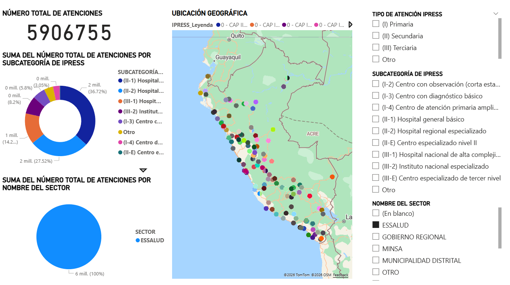

# Análisis de Atención de Emergencias en IPRESS del Perú (Business Intelligence)
Análisis de la base de datos pública sobre emergencias IPRESS ocurridas en 2021, BD extraída del sitio web de SUSALUD. Proyecto realizado durante mi 9no ciclo de la universidad.

## Descripción del proyecto
Este proyecto de Business Intelligence analiza la producción asistencial en servicios de emergencia en el Perú durante el año 2021 utilizando datos abiertos de SUSALUD.
El objetivo es identificar patrones de atención, distribución de pacientes y diferencias regionales que puedan apoyar la toma de decisiones en el sistema de salud.

## Fuente de datos
Datos obtenidos de:
SUSALUD – "Consulta C1: Producción Asistencial en Emergencias por IPRESS (2021)"
El dataset contiene información sobre:
- Tipo de establecimiento de salud (IPRESS)
- Región
- Sexo del paciente
- Grupo etario
- Número de atenciones
- Número de pacientes atendidos

## Herramientas utilizadas
- Microsoft Excel – limpieza y preparación de datos
- Power Query – transformación de datos
- Power BI – modelado y visualización
- Microsoft Access – almacenamiento intermedio de datos

## Proceso de Business Intelligence
El proyecto siguió las siguientes etapas:
1. Extracción de datos desde la base de SUSALUD.
2. Limpieza y transformación de datos (ETL).
3. Modelado de datos con esquema estrella.
4. Creación de dashboards interactivos en Power BI.

## Principales hallazgos
En cuanto a las atenciones por emergencia de IPRESS en el año 2021: 
- Lima concentró la mayor cantidad de atenciones de emergencia,
- El grupo etario con mayor número de pacientes fue el de niños,
- Las IPRESS de nivel II concentraron gran parte de la demanda,
- Los establecimientos públicos atendieron la mayor proporción de emergencias.

# Visualizaciones en Power BI

## 
